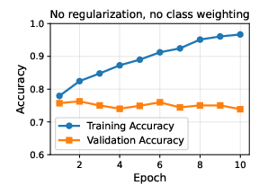
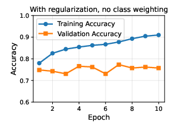
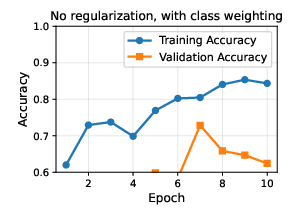
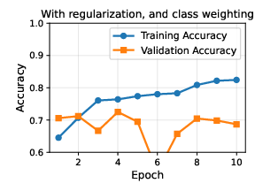
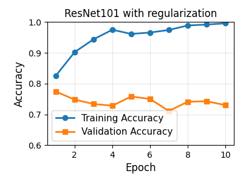

# Alzheimer's Disease Severity Classification from MRI Images

We apply machine learning models to predict Alzheimer's disease severity from brain MRI images from the OASIS dataset [1]. All models considered are convolutional neural networks. We find that most of the models tend to over fit the training data, and don't generalize very nicely. 
We implement multiple regularization methods to the loss function to try to solve this problem. 

## Dataset Structure

The dataset contains MRI images organized into 4 classes:
- **Non Demented** (Class 0)
- **Very mild Dementia** (Class 1)
- **Mild Dementia** (Class 2)
- **Moderate Dementia** (Class 3)

Images are named in the format: `OAS1_####_MR1_mpr-1_###.jpg` where `####` is the patient number.

## Setup

1. Install required packages:
```bash
pip install -r requirements.txt
```

## Usage

### Step 1: Prepare Dataset Split

The dataset is split by **patient number** (not individual images) to avoid data leakage. This ensures that all images from the same patient are in either the training or validation set, but never both.

```bash
python prepare_dataset.py
```

This script will:
- Extract patient numbers from all image filenames
- Split patients into train (50%) and validation (50%) sets. The reason for this 50-50 split is that we only have two patients in the moderate dementia class. 
- Organize images into `dataset_split/train/` and `dataset_split/val/` folders
- Print detailed statistics about the split

**Output:**
- `dataset_split/train/` - Training images organized by class
- `dataset_split/val/` - Validation images organized by class

### Step 2: Train the Model

```bash
python train_model.py
```

This script will:
- Load the prepared dataset
- Create a model (supports multiple architectures: ResNet, EfficientNet, DenseNet, VGG, MobileNet, Inception, AlexNet)
- Train the model with data augmentation and regularization options
- Save the best model as `best_models/best_model_{model_name}.pth`
- Display training/validation metrics, classification report, and accuracy plots

**Training Parameters:**
- Configurable epochs, batch size, and learning rate
- Multiple model architectures available
- Regularization options: L2 (weight decay), L1, dropout, label smoothing
- Class weighting for handling imbalanced data

## Model Architecture

The project supports multiple architectures:
- **ResNet**: resnet18, resnet34, resnet50, resnet101, resnet152
- **EfficientNet**: efficientnet_b0 through efficientnet_b7
- **DenseNet**: densenet121, densenet169, densenet201
- **VGG**: vgg11, vgg13, vgg16, vgg19
- **MobileNet**: mobilenet_v2, mobilenet_v3_small, mobilenet_v3_large
- **Inception**: inception_v3
- **AlexNet**: alexnet

All models use pretrained ImageNet weights with the final layer replaced to output 4 classes.

**Data Augmentation (Training only):**
- Random horizontal flip
- Random rotation (±10 degrees)
- Color jitter (brightness and contrast)
- Resize to 224x224
- Normalization (ImageNet statistics)

## Files

- `prepare_dataset.py` - Creates train/validation split based on patient numbers
- `train_model.py` - Trains the Alzheimer's severity classification model (4-class)
- `test_model.py` - Script to test trained models
- `requirements.txt` - Python dependencies
- `best_models/` - Directory containing saved model weights


# Results for AlexNet

## Experimental Results and Discussion

We conducted several experiments with AlexNet to investigate the effects of regularization and class weighting on model performance. 
We focus on AlexNet because we found it to be the faster to train, leading to faster experimentation, while initial results showed similar accuracy to resnet101. 
The results are visualized in the `figures/` directory:

### Experimental Configurations

1. **Baseline (No Regularization, No Class Weighting)**
   
   
   
Baseline model without regularization or class weighting. We see a big gap between the accuracy on the training data vs the validation data set. This suggest over fitting. One can try to over come this with adding regularization. 

2. **Regularization Only (No Class Weighting)**
   
   
   
Indeed regularization reduced the gap between the accuracy on the training and validation data sets. However, it more reduced the accuracy on the training data set more than increased the accuracy on the validation data set. 

3. **Class Weighting Only (No Regularization)**
   
   
   
Here class weights are added in such that class $i$ is weighted in loss function by $w_i \propto 1/||S_i||^\alpha$ where $||S_i||$ is the size of the set of images from the training data set belonging to class $i$/. $\alpha$ can be thought of as a hyperparameter. Here we used $\alpha = 0.6$, but proper scan of this parameter wasn't performed. 


4. **Regularization + Class Weighting**
   
   
   
   Model with both regularization and class weighting.

# Results for ResNet101

   
   
ResNet101 shows similar performance. To AlexNet. Interestingly, it seems that there is some threshold on the accuracy of about $\approx 0.77$. A model that predicts all class weights to be non-demented would have an accuracy of $0.77$. Even though these model (either ResNet or AlexNet) do not simply predict all images as non-demented, it seems that they still struggle to cross this threshold. 


[1] Open Access Series of Imaging Studies (OASIS): Cross-Sectional MRI Data in Young, Middle Aged, Nondemented, and Demented Older Adults. Marcus, DS, Wang, TH, Parker, J, Csernansky, JG, Morris, JC, Buckner, RL. Journal of Cognitive Neuroscience, 19, 1498-1507. doi: 10.1162/jocn.2007.19.9.1498

